TODO: Small intro...

## Table Of Contents
1. [Introduction To Hair Ray-Tracing](#introduction)
    1. [The Ray-Tracing Pipeline](#ray-tracing-pipeline)
    2. [Defining The Problem](#defining-the-problem)
    3. [Storing Hair Model Data](#stroing-hair-model-data)
2. [Hair Primitives](#hair-primitives)
    1. [DOTS: Disjoint Orthoginal Triangle Strips](#dots)
    2. [The Phantom Ray-Hair Intersector](#prhi) 
    3. [LSS: Linear Swept Spheres](#lss)
    4. [RoCaps: Roving Capsules](#rocaps) 
3. [Conclusion](#conclusion)
   1. [Further Reading](#further-reading)
   2. [Sources](#sources)

## Introduction To Hair Ray-Tracing <a name="introduction"></a>

TODO...

### The Ray-Tracing Pipeline: A Quick Recap <a name="ray-tracing-pipeline"></a>

But first let’s take a quick detour to talk about some important concepts we’ll need to implement our hair geometry.

In ray-tracing we send out rays from the camera’s point of view inside the ray generation shader. These rays then traverse an acceleration structure, to travel through our scene, which in Vulkan’s case is a bounding volume hierarchy that stores instances of our geometry.

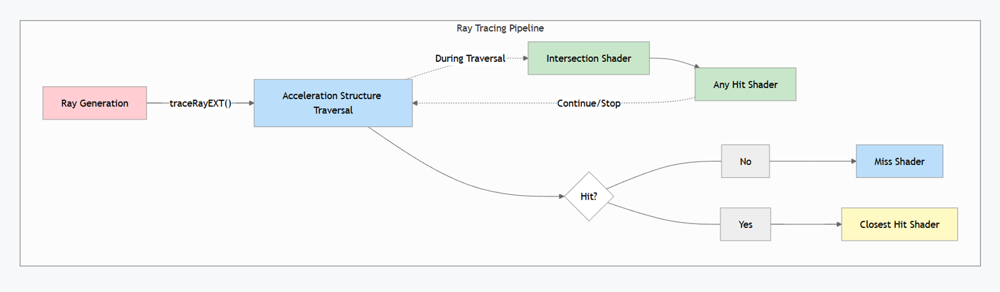

During the traversal we check using an intersection shader if we intersected with any geometry. When a ray passes this check, an any hit shader is called. This shader is used to tell our pipeline if we want to continue the traversal or discard our ray. This functionality can be used to performs things like alpha-testing to discard intersections.

Finally, the closest hit program is invoked on the intersection closest to the ray origin. It is used to retrieve our geometry information, like positions and normals, and usually used to perform the shading itself. In case our ray doesn’t hit anything, the miss shader is called, which can be used to give the background a color or to render an environment map.

In our case, we are the most interested in the intersection shader, as it allows us to test intersections with our own custom geometry.

### Defining The Problem <a name="defining-the-problem"></a>

So now that we have a basic understanding of the ray-tracing pipeline, we can go back to focus on rendering hair. Let’s first look at what problem we are trying to solve here.

And since we want to render hair models, why not just use textured cards? They are a good way to achieve reasonable quality for hair on a tight frame budget. However, this kind of setup is very limited since a single textured card has multiple hair strands per card which limits control over individual strands. So, by design this approach does not allow much room for simulating or animating hair.

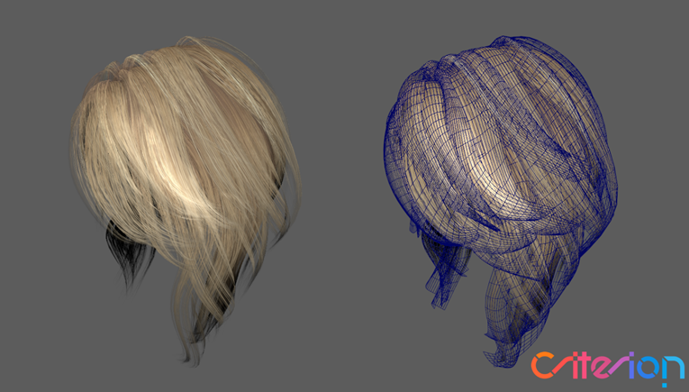

That is where strand-based approaches come in, where we give each hair strand its own geometry. This would give us finer control over how the hair looks like and give us flexibility to animate and simulate the geometry accurately.


But in-turn by using strand-based approaches, we encounter other problems. Like ray-tracing thin geometry that is elongated on an axis, which is horrible for BVH traversal performance. Since elongated geometries have non-optimal bounding volumes with lost of empty space and more overlap between other volumes close by. This results in a higher chance of intersecting the geometry and needing to check more intersections, which we want to avoid if possible.

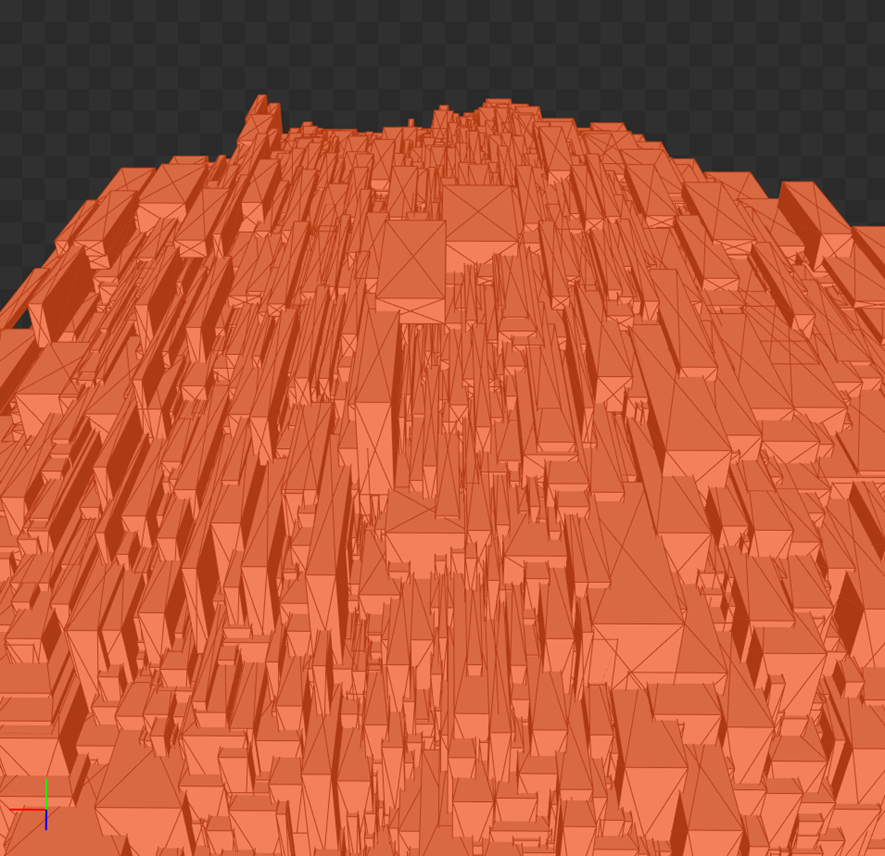

There is also the important question of what geometric primitive we want use to represent the individual hair strands. And how many strands do we want to use for hair models? Do we subdivide the hair strands into segments? If so, how many? We’ll take a closer look at these problems throughout this presentation, and I’ll showcase some solutions to them or make them less prominent.

### Storing Hair Model Data <a name="stroing-hair-model-data"></a>

Before rendering any hair model, let’s first look at how we create and store them.

Instead of using triangles, we can use poly lines to approximate the form of a hair strand. Each vertex in a polyline would store a position and a radius, which we would use for the thickness of the hair strand. Such an approximation comes with a cost of quality of course, because we divide the hair strand into segments, we can see that it is not smooth. We could fix such an issue by simply adding more poly line vertices until we think it looks good enough.

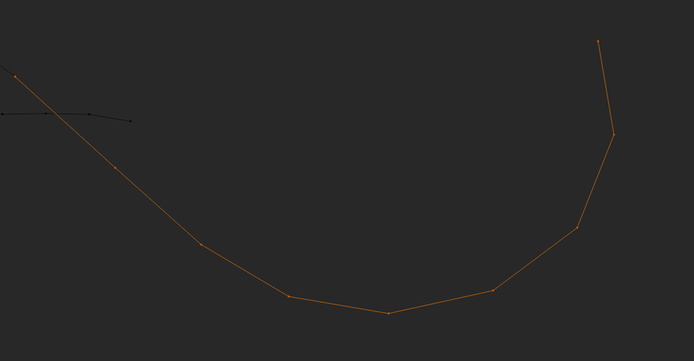

But there is also another solution to this problem. We can also use curves to store our hair models. This gets rid of the segmentation entirely, as even when using multiple curves for a hair strand, we can connect them seamlessly. So, it gives us a more realistic result as it correctly follows the path a real hair strand would have. That also means that we can potentially use less curve primitives to create hair compared to polylines, as we no longer need to approximate the path using straight segments.

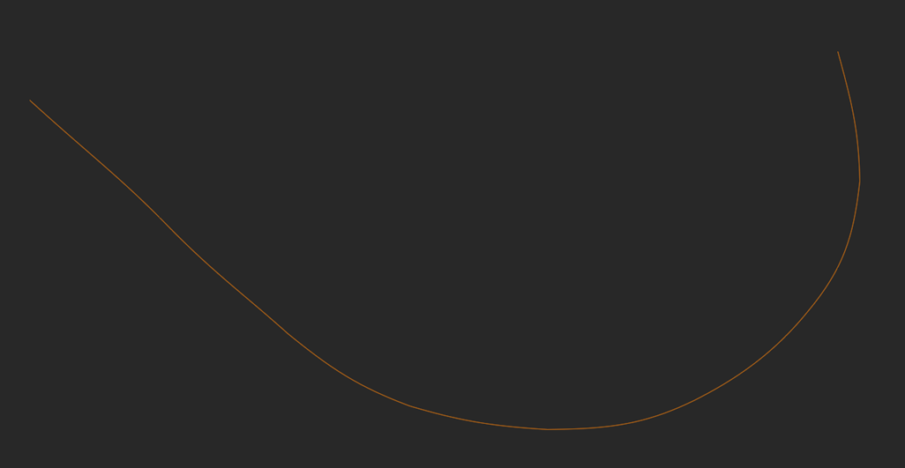

## Hair Primitives <a name="hair-primitives"></a>

Now that we understand what data we are working with and what questions we want to answer, we can finally look at ray-tracing hair. So let's talk rendering the curve geometry.

### DOTS: Disjoint Orthogonal Triangle Strips <a name="dots"></a>

The ray-tracing hardware excels in performing ray-triangle intersections, so why not use them for hair strands? The first technique that does just that, Disjoint Orthogonal Triangle Strips. Or in short DOTS.

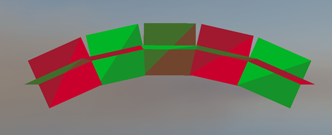


DOTS is solution for tessellating curves by using 2 orthogonal quads per segment, which enables viewing from any angle without having to re-orient the triangles to face the camera.
We tessellate such segments by sampling a curved hair strand segment n number of times depending on how much detail we want to create straight line segments.Then we iterate over all the sampled lines to build an orthogonal frame on the line and generate the vertices along both face axes, also taking into account the hair strand radius.

Then we take all these generated triangles and construct a BVH the same way we do as for normal triangle meshes.

This is a pretty good approximation at medium to far distances. But, you may already notice a couple of issues with this approach. For example, how are we going to shade those segments when they are orthogonal to each other?

The quads we use are not naturally round, so we can’t just take the geometry normal to shade the fragments. Although, we can somewhat fix this issue by rounding the geometry normals based on how close the normal is to the edge of the quad. This would give us a better shading normal that approximates how a round primitive that has volume would look like.

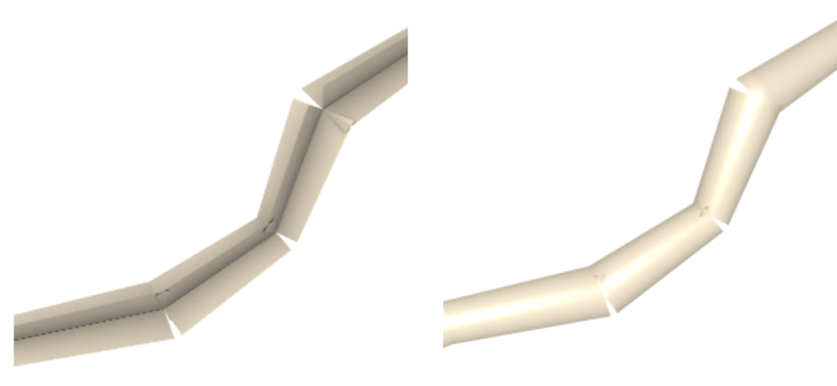

But when we go back to the primitive visualization once more.

Another glaring issue is that we regressed from using curves for smooth hair strands to again approximating them. There are also gaps between each segment, but this is negligible and is only seen when you’re really close to the hair strands.
Both issues can be a bit alleviated by adding more segments to the model when viewing it from medium or far distances but can’t be entirely mitigated at close distances.


So how are we going to solve that?

### The Phantom Ray-Hair Intersector <a name="prhi"></a>

That’s where the Phantom Ray-Hair Intersector comes in.

It allows us to use our curve data directly in our custom intersection shader to check ray-curve intersections, which results in an accurate and smooth hair strand.
The hair strand itself is now also a volume and has accurate normals, which looks much better than our previous method. We also can turn the end caps, which would be flat, on or off.

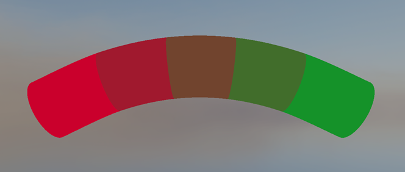

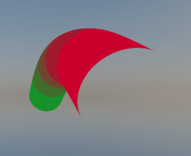

But how do we use our curve data to implement the phantom ray-hair intersector?

#### The Implementation - AABB construction

Now we are working with our own custom curve primitive, which means first we must generate our own acceleration structure that the ray can traverse through.
Luckily Vulkan allows us to feed it axis aligned bounding boxes instead of triangle data, as leaf nodes for BVH construction.

```c++
vk::AccelerationStructureGeometryAabbsDataKHR aabbData {};
aabbData.data = aabbBufferDeviceAddress;
aabbData.stride = sizeof(AABB);

vk::AccelerationStructureGeometryKHR& accelerationStructureGeometry = output.geometry;
accelerationStructureGeometry.flags = vk::GeometryFlagBitsKHR::eOpaque;
accelerationStructureGeometry.geometryType = vk::GeometryTypeKHR::eAabbs;
accelerationStructureGeometry.geometry.aabbs = aabbData; // Instead of triangles, we give AABBs

const uint32_t primitiveCount = hair.aabbCount;

vk::AccelerationStructureBuildRangeInfoKHR& buildRangeInfo = output.info;
buildRangeInfo.primitiveCount = primitiveCount;
buildRangeInfo.primitiveOffset = 0;
buildRangeInfo.firstVertex = 0;
buildRangeInfo.transformOffset = 0;

vk::DeviceOrHostAddressConstKHR curvePrimitiveBufferDeviceAddress {};
curvePrimitiveBufferDeviceAddress.deviceAddress = vulkanContext->GetBufferDeviceAddress(model->curveBuffer->buffer);

GeometryNodeCreation& nodeCreation = output.node;
nodeCreation.primitiveBufferDeviceAddress = curvePrimitiveBufferDeviceAddress.deviceAddress;
nodeCreation.material = hair.material;
```

Then in our intersection shader we can get our curve data using the primitive ID that is the index to the leaf node AABB. Since each curve has its own bounding box,
The same index can be reused to access the curve buffer.

```glsl
void main()
{
    BLASInstance blasInstance = blasInstances[gl_InstanceCustomIndexEXT];
    GeometryNode geometryNode = geometryNodes[blasInstance.firstGeometryIndex + gl_GeometryIndexEXT];

    Curves curves = Curves(geometryNode.primitiveBufferDeviceAddress);
    Curve curve = curves.curves[gl_PrimitiveID];

    // Use curve data for intersection check...
}
```

Because of this, we only need to generate our AABBs for each curve.

If we want a quick solution to approximate a bounding box, we can just include the control points inside the AABB as well.
Although this is a pretty bad solution as it leaves even more empty space in the AABB, so it adds quite a lot of overhead when tracing rays throughout the hair model.

```c++
std::vector<AABB> GenerateAABBs(const std::vector<Curve>& curves, float curveRadius)
{
    std::vector<AABB> aabbs(curves.size());

    for (uint32_t i = 0; i < curves.size(); ++i)
    {
        const Curve& curve = curves[i];
        AABB& aabb = aabbs[i];

        aabb.min = glm::min(glm::min(curve.start, curve.end), glm::min(curve.controlPoint1, curve.controlPoint2)) - curveRadius;
        aabb.max = glm::max(glm::max(curve.start, curve.end), glm::max(curve.controlPoint1, curve.controlPoint2)) + curveRadius;
    }

    return aabbs;
}
```

Instead, we could use a derivative and find the curve’s roots on all axes. This would give us the curve’s extremities. Then if we make sure all these, points together with the start and end point of the curve are all inside the bounding box, it would give us an accurate AABB that tightly bounds the curve.
But as this process can be quite complicated to explain and is math-heavy, it would take some time to explain fully, so I won’t be explaining it in detail. TODO: Add link to source...

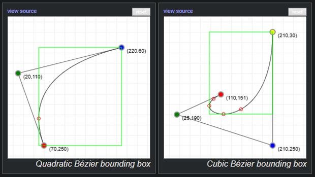

One of the problems we mentioned at the beginning was that thin long geometry was bad for BVH traversal. We can somewhat overcome this during BVH creation, by generating multiple bounding boxes for curves, which removes a lot of empty space in some instances.

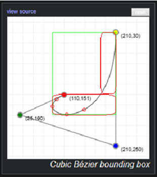

So now that we have our BVH ready and we can traverse through it, we want to iteratively find the ray-curve intersection. So, let’s take a look at how we can do that.

#### Phantom Ray-Hair Intersector - The Implementation

We’ll start our iterations at t 0 or 1, where t is the distance along the curve. Each iteration has 3 main steps we have to perform.

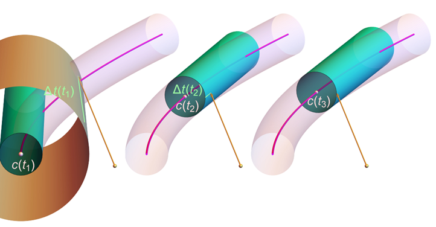

1. We first create a cone at distance t along the curve that has the same radius as the thickness of our hair strand. The cone’s axis will travel straight toward the direction we’re trying to converge to.

2. Next we check for the ray-cone intersection. If we intersected the cone and the cone’s start point is close enough to the projected intersection point onto the cone’s base, we can report the intersection and extract the needed information like the position, normals etc. We need to do the second check, where project the intersection point as well, since otherwise we could report an intersection with the cone that would not be on the curve.

3. In case we didn’t find the intersection, we go to step 3, where we use the projected intersection point onto the curve, to travel along it to the next t value. If we are outside of the curve, then we know the ray won’t intersect the curve and we can safely return. If t is still in bounds, we go back to step 1 and iterate until we find an intersection or reach the max iteration count.

After running this algorithm, we’ll have rendered our curve.

#### Phantom Ray-Hair Intersector - The Downsides

But of course, there are downsides. Some curves are impossible to render. For example, if you have a curve that wraps around too much, the real intersection can be hidden by phantom ones, and the ray will never hit the curve as seen on the left picture.
Although that can be fixed by pre-processing the curves and splitting them whenever they wrap around too much.

Another example of an impossible curve is when the start and end radii differ too much, although such as cases are unlikely to happen in real hair models.

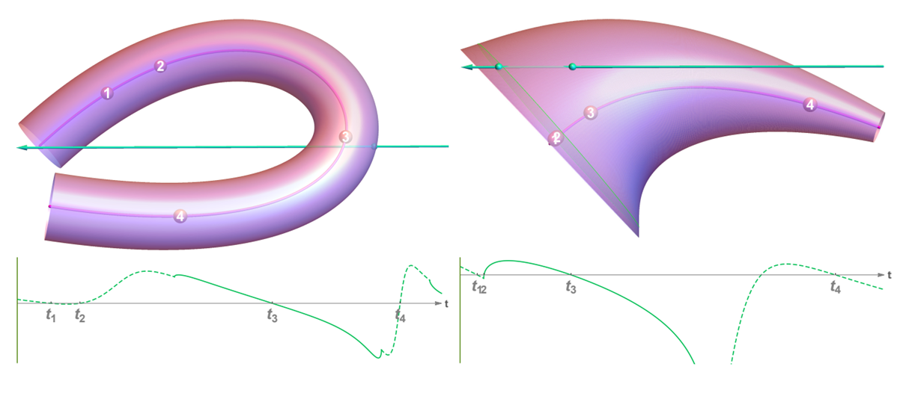

There is another big downside to this algorithm. The phantom ray hair intersector runs on average 1.5 times slower than our previous technique where we used triangles.
Due to the nature of it being an iterative approach, the time to intersect with a curve is not constant, so in some cases it may run even slower.

Or at least on my implementation… There are some micro-optimizations I could implement to make the iterative process faster, or optimizations I have not applied to traversing the acceleration structure. But first let’s keep looking if we can find a technique that doesn’t sacrifice as much frame time for quality.

### LSS: Linear Swept Spheres <a name="lss"></a>

Last year, in 2025, NVIDIA released a new ray-tracing primitive with hardware support, Linear Swept Spheres. One of the main applications of the LSS primitive is rendering hair geometry.

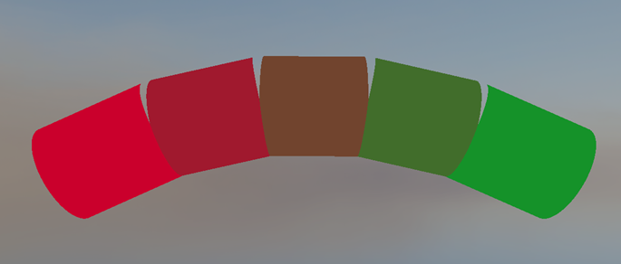

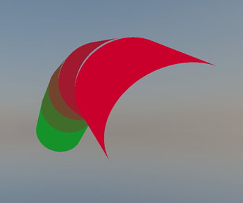

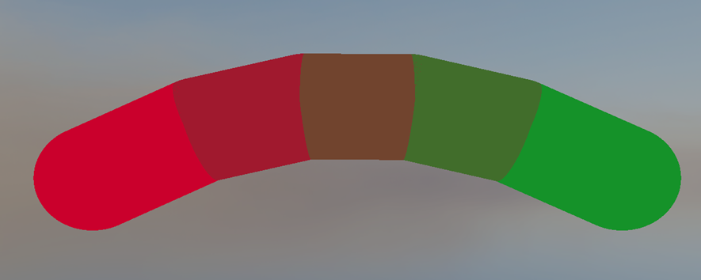

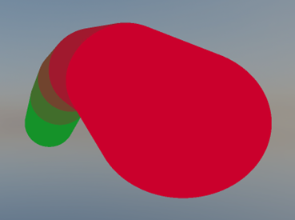

The primitive is a round 3D line with varying radii shaped like a cylinder or cone with optional spheres used as end caps. By chaining them together one after the other we can build curves to represent our hair strands.
Since it is hardware accelerated and the intersection time is constant, it is really fast and runs around the same speed as our first solution that used triangles, but compared to them, it drastically improves memory usage, as we only need to store a position and radius per vertex, where each line has 2 vertices.

But as you may have noticed the curve has been segmented again into sections, which makes the hair strand no longer smooth. And another big limitation is that since its hardware accelerated, it only works on NVIDIA 50xx series GPUs.
So, let’s see if we can do something about these 2 issues.

### RoCaps: Roving Capsules <a name="rocaps"></a>

And we’re in luck, as the LSS primitive from NVIDIA is based off of a paper from 2024 which proposes that hair strands can be modeled by sweeping spheres with varying radii along curves.

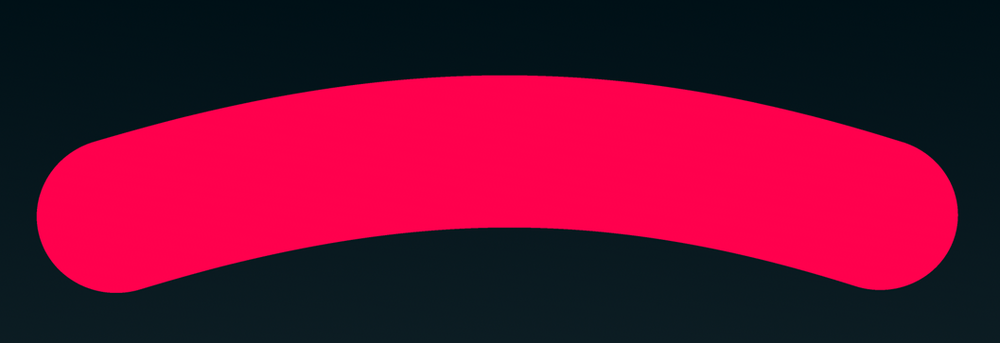

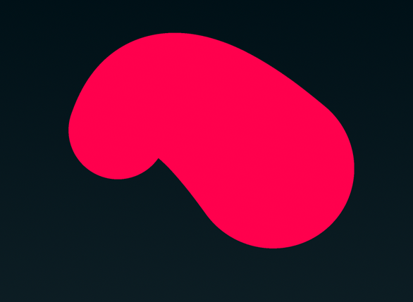

Such shapes can be ray-traced by finding intersections of a given ray with a set of roving capsules defined at runtime. Or RoCaps in short.
It is also an iterative approach, but it gets a substantial performance boost by eliminating parts of the curved shape that are guaranteed not to intersect with a given ray.
This results in an improvement of ~30% overall in performance over the phantom ray-hair intersector.

#### RoCaps - The Implementation

TODO: Mention that AABB creation has to happen here as well...

The algorithm works by finding possible intervals where the ray could intersect by iteratively eliminating parts that are guaranteed not to intersect.

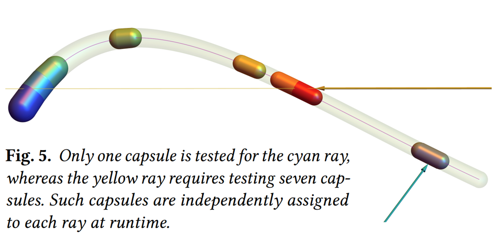

The for each interval, we make it smaller by checking if a sphere bounding the interval intersects with the ray. If it does, we know we can still intersect with the curve. This is also where the swept spheres name comes from. But if it doesn’t we approximate the root of the interval on the curve. This either makes the interval smaller and deletes it entirely.

If the interval is still there, we compute a capsule also taking into consideration the radius of the curve at the current point and try to intersect with it.
We repeat this process until we intersect or the interval disappears. And due to finding possible intersection intervals at the beginning, an intersection is usually found within 1 or 2 iterations.

#### RoCaps - The Downsides

Using quadratic or cubic Bezier curves, adding more control points results in more complex root approximation and is not worth it for performance.

Also, when a curve is quickly changing along with it’s radius, it can lead to the curve folding onto itself. But again, such a scenario is very unlikely to happen with a hair model.

But the problems we had with our phantom ray-hair intersector are gone!


#### RoCaps - Comparing to LSS

Why implement the algorithm in linear segments? I have had the chance to talk to an NVIDIA employee that worked on the technology and ask him about it.

Since LSS is on a linear segment as that allows for a non-iterative implementation.

This is better for a hardware port as non-iterative implementations have a predictable execution flow, which means you can make assumptions and optimize for it. For example, is known what the exact resource usage will be and it can be accounted for. It is also easier to implement as the sequential flow of logic gates and registers is easier to verify and is less prone to errors.

### Bonus: Voxels?  <a name="voxels"></a>

TODO...


## Conclusion <a name="conclusion"></a>

So, in the end what technique should you use? That depends...

You should ask yourself what you are trying to use it for. Curly hair using linear primitives will require much more detail, while curved primitives can easily represent such models.
Although curved primitives require iterative approaches to resolve their intersections and will be slower to run.

### Further Reading <a name="further-reading"></a>

TODO...

### Sources <a name="sources"></a>

- [1] [*Alexander Reshetov and David Luebke. Phantom Ray-Hair Intersector, 2018*](https://research.nvidia.com/sites/default/files/pubs/2018-08_Phantom-Ray-Hair-Intersector//Phantom-HPG%202018.pdf)
- [2] [*Alexander Reshetov and David Hart. Modeling Hair Strands with Roving Capsules, 2024*](https://www.researchgate.net/publication/381317645_Modeling_Hair_Strands_with_Roving_Capsules)
- [3] [*Alexander Reshetov and David Hart. Roving Capsules Shadertoy Demonstration, 2024*](https://www.shadertoy.com/view/4ffXWs)
- [4] [*David Hart and Pawel Kozlowski. Render Path-Traced Hair in Real Time with NVIDIA GeForce RTX 50 Series GPUs, 2025*](https://developer.nvidia.com/blog/render-path-traced-hair-in-real-time-with-nvidia-geforce-rtx-50-series-gpus/)
- [5] [*Mike "Pomax" Kamermans. A Primer on Bézier Curves, 2011-2020*](https://pomax.github.io/bezierinfo/)
- [6] [*Juha Sjoholm. Best Practices for Using NVIDIA RTX Ray Tracing (Updated), 2022*](https://developer.nvidia.com/blog/best-practices-for-using-nvidia-rtx-ray-tracing-updated/)
- [7] [*NVIDIA. RTX Character Rendering GitHub repository*](https://github.com/NVIDIA-RTX/RTXCR)

---